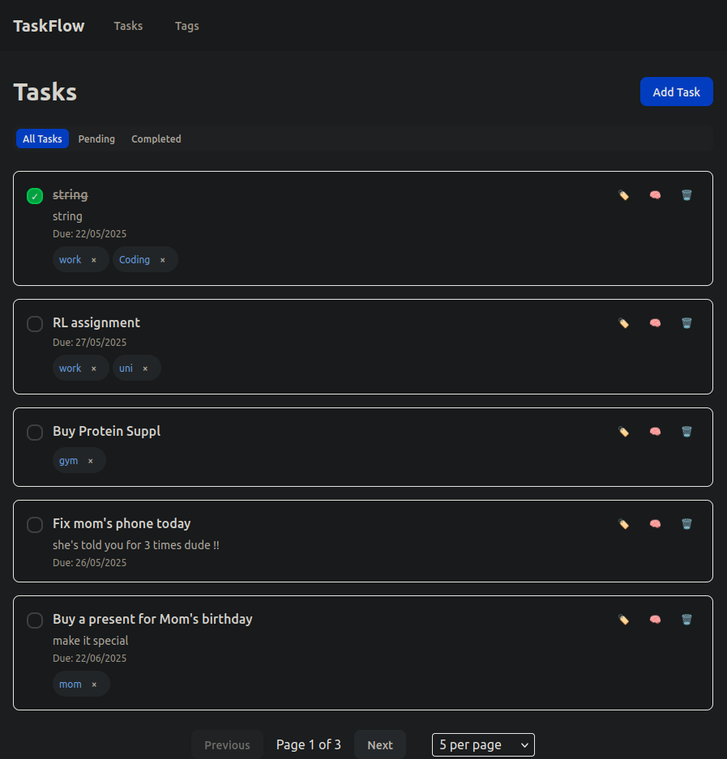

# Smart ToDo List Web APP

## Service Features
- Core Features:
    - Add, edit, delete, mark-as-done, tag, untag tasks.
    - Local Database with SQLite;
    - No user authentication
    - Scalable by design! we can simply add more services, more attributes for tasks and tags, etc without re-structuring the architecture.
    - Clean code with one-line API functions 

- LLM Feature:
    - Smart Tagging (labeling) : The LLM assigns tags based on the task description.
    - For now, it supports Gemini (only "gemini-2.0-flash") and OpaenAI (only "gpt-4o") models. (If you provide both API keys, then we use Gemini)

- Frontend Features:
    - No blocking error
    - Pagination for tasks





## Key Design and Architectural Choices

The project has a modular design with easy navigation and clean separation of concerns.

### LLM:
- Prompt Strategy:
    - Markdown Prompt
    - Multiple examples, including a Prompt Injection example to avoid
- Structured Output + Output Type Checking for safe LLM interaction
- Graceful API or connection error handling
- TODO: Switch to a different model or provider when an LLM API is unavailable. (already support 2 LLMs, but yet to support each other)

### Database
- Many-to-Many relationship between tasks and tags


## Tech stack
- Python Backend:
    - Project manager: uv
    - LLM: LangChain
    - API: FastAPI
    - ORM: SQLModel
    - Type Check: pydantic, pydantic-settings
    - Test: pytest
    - Lint and Format: ruff

- Frontend:
    - React + TypeScript + Vite
    - Tailwind CSS
    - Test: Vitest
    - Lint: ESLint
    - Format: Prettier


## How to use it?

1. **Clone the repository and navigate to the project root**

2. **Set up environment variables for the backend and the frontend using the .env.example files**

3. **Build and start the application**:

### Docker 
Note: For development, we **allow any site to make CORS requests**, which must NOT be used for production.

```bash
# Dev mode (use bind mounts for hot reloading without requiring rebuilds on code changes.)
./scripts/dev.sh

# Prod mode with Nginx
./scripts/prod.sh
```
Visit http://localhost for the UI

Note: For the sake of security and flexibility, secrets should be injected at runtime, not baked into images.

### Without Docker
- Backend
    - Install [uv](https://docs.astral.sh/uv/#highlights) first, if you haven't already. (you'll thank me later!)
    - Then:

```bash
cd backend

# uv installs and create the environments
uv sync

# run backend server
uv run fastapi dev main.py
```
Go to http://127.0.0.1:8000/docs to check the API docs.

- Frontend
```bash
cd frontend

# npm installs the dependencies
npm install

# run the frontend server
npm run dev
```

Go to http://127.0.0.1:3000 to see the UI.


### Run Tests

- Backend API and Service Tests (with mocked LLM Call)
```bash
cd backend/test
pytest
```

- Frontend API Integration Test
```bash
cd frontend

# Run all API tests
npm run test:api
# Run tests in watch mode
npm run test:watch
# Run specific test file
npx vitest src/test/api/tasksApi.test.ts 
# Run with UI (optional)
npm run test:ui
```